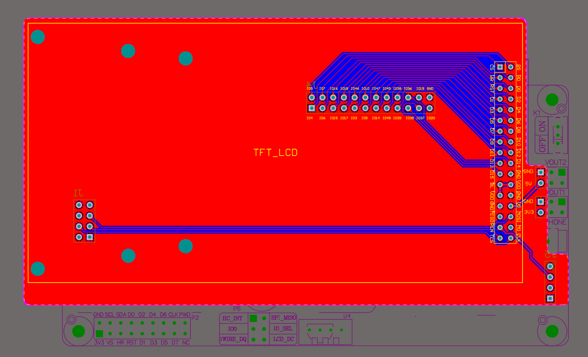

# LVGL develop framework for ALIENTEK DNESP32S3 AI Board

## Feature

### ✨ Highlights

QMA6100P for orientation detect

GT911 most 5 points touch supported

i80 bus for LCD

### 🎯 Clear Layered Separation

|Layer |	Directory |	Responsibility |
|---|---|---|
|Application|main|Entry point & business logic|
|Middleware|gui|  GUI framework|
|Middleware|lvgl_port|  LVGL porting|
|Dependencies| managed_components |Third-party libraries|
|||

### 🛠️ Hardware

[ALIENTEK ESP32 develop kit](https://detail.tmall.com/item.htm?id=768499342659&mi_id=0000Rnp7usDZhCKI8iOwmobugAiJh6WRmzb1NQwAgrAOUnU&spm=tbpc.boughtlist.suborder_itemtitle.1.20082e8dzYaMCf)

[4.3inch MCU touch LCD](https://detail.tmall.com/item.htm?abbucket=8&id=609533166111&mi_id=0000hXKZCfFOVsgzS_AQiMuBrU2C_l2JdZhp_Hab_mfRUJA&rn=38de1796b4cceb65be58bfbc7131f480&spm=a1z10.3-b.w4011-22300962502.34.107d7467x696ga)

customized carrier board

I previously bought an [STM32 develop kit](https://detail.tmall.com/item.htm?id=609294889447&mi_id=0000JBr1UssLL6l3XRQR9FbL--51aCU43sJtpWSclELG-Vg&skuId=4453886223905&spm=tbpc.boughtlist.suborder_itemtitle.1.20082e8dzYaMCf) 
bundled with this 4.3" MCU touch LCD. Rather than let it sit idle, I designed this 
custom PCB carrier board to adapt the screen to the ESP32-S3 — so nothing goes to waste.

## Reference

[espressif lcd develop guide](https://docs.espressif.com/projects/esp-iot-solution/zh_CN/latest/display/lcd/lcd_development_guide.html)

[espressif touch develop guide](https://docs.espressif.com/projects/esp-iot-solution/zh_CN/latest/input_device/touch_panel.html)

[lvgl](https://lvgl.io/docs/open/widgets/switch)

[lvgl porting](https://www.bilibili.com/video/BV1k7bHzHEzB/?share_source=copy_web&vd_source=47571a48910d5ce877ff1a62baf22c92)

